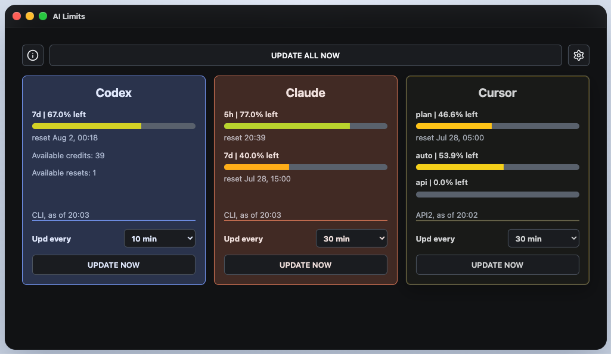
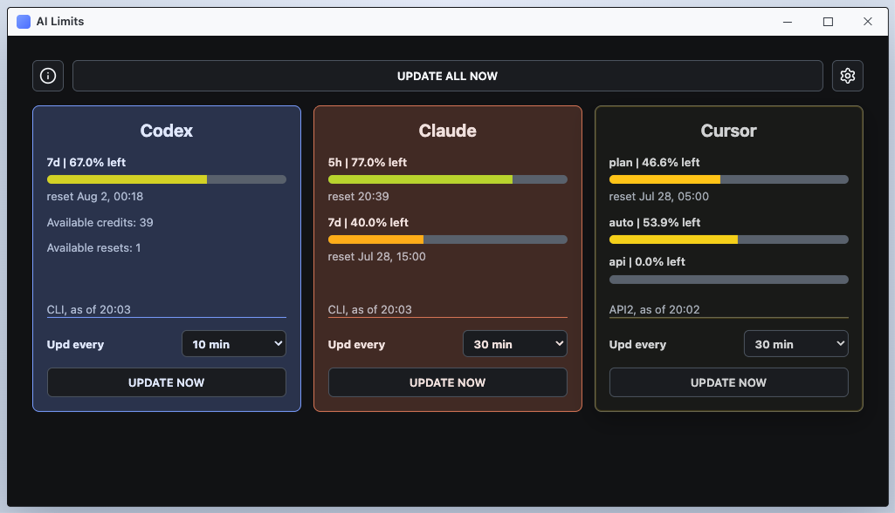
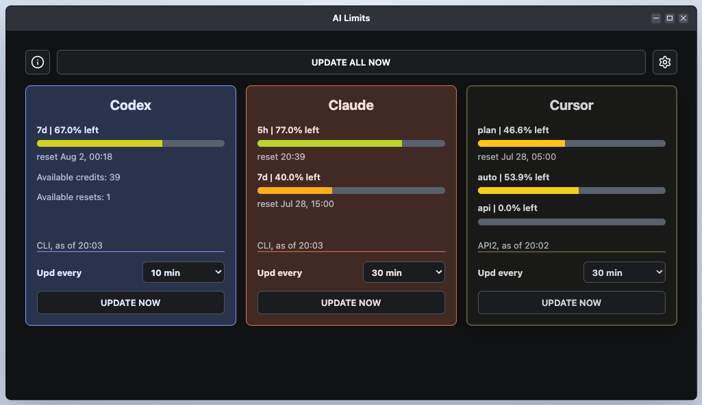
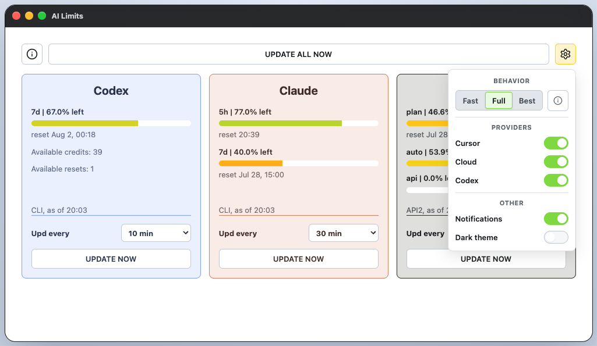
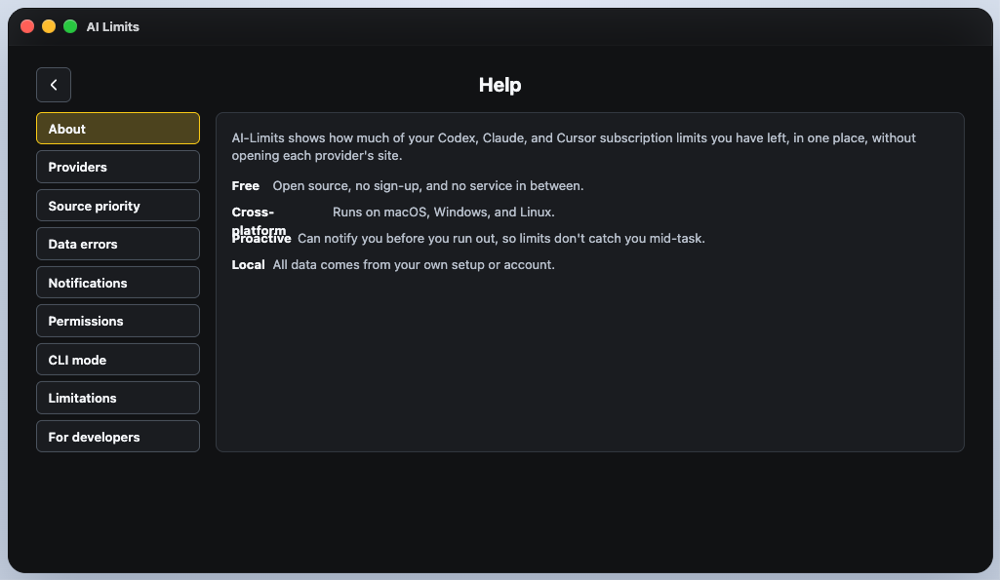

# ai-limits

| [DE](docs/readmes/DE.md) | EN | [ES](docs/readmes/ES.md) | [FR](docs/readmes/FR.md) | [PT](docs/readmes/PT.md) | [RU](docs/readmes/RU.md) | [中文](docs/readmes/ZH.md) | [عربي](docs/readmes/AR.md) |

---

  
  
  

---

A local app for tracking AI subscription limits and usage across Codex, Claude, and Cursor.

Benefits:
- Works without an API subscription,
- No sign-ins,
- All providers in one place,
- Completely free,
- Private: no third-party services, proxies, or registrations,
- Lightweight desktop app for macOS, Windows, and Linux,
- Limit notifications,
- Open source.

  
  
  
  

## Features

- Shows limits, reset date and time, available tokens, and available manual resets,
- Works with Codex, Claude, and Cursor,
- Retrieves data from local files, provider CLIs, and APIs,
- Falls back to another source when one is unavailable,
- Lightweight desktop app for macOS, Windows, and Linux,
- CLI with several output formats: `./bin/ai-limits`,
- Native system notifications when limits reach configured thresholds,
- Manual and flexible automatic data refresh.

## Alternatives

| | **ai-limits** | [CodexBar](https://github.com/steipete/CodexBar) | [caut](https://github.com/Dicklesworthstone/coding_agent_usage_tracker) |
| --- | :---: | :---: | :---: |
| Desktop app and CLI | ✅ | ✅ | ❌ |
| Codex, Claude, and Cursor | ✅ | ✅ | ✅ |
| macOS, Windows, and Linux | ✅ | ❌ | ❌ |
| No intermediary service | ✅ | ✅ | ✅ |

The full comparison covers 18 alternatives and 16 criteria: [alternatives catalog](docs/product/analogues.tsv).

## Platform support and limitations

- macOS: the app is signed and notarized; notifications work,
- Windows and Linux: builds are available; support evolves based on user feedback,
- Desktop notifications are currently available only on macOS,
- Some local Codex and Claude sources may not work on Windows and Linux yet; CLI sources work everywhere.

## License

[MIT License](LICENSE)
