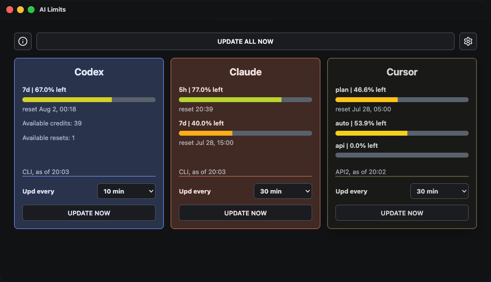
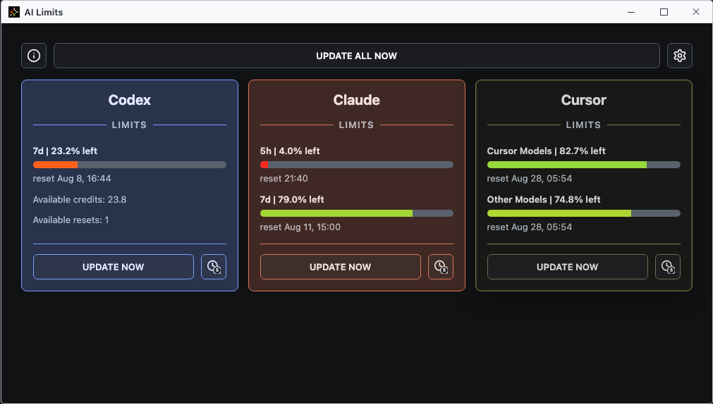
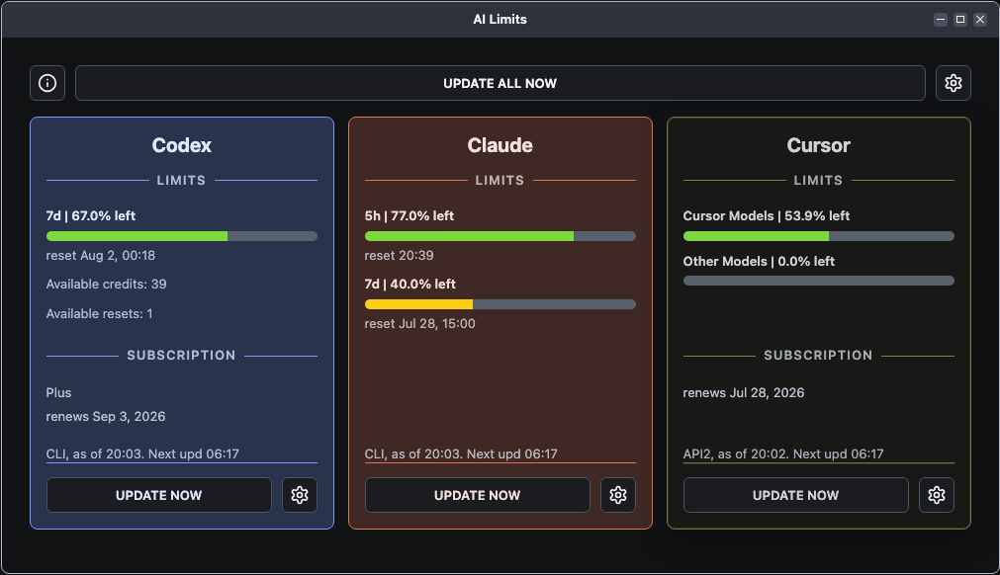
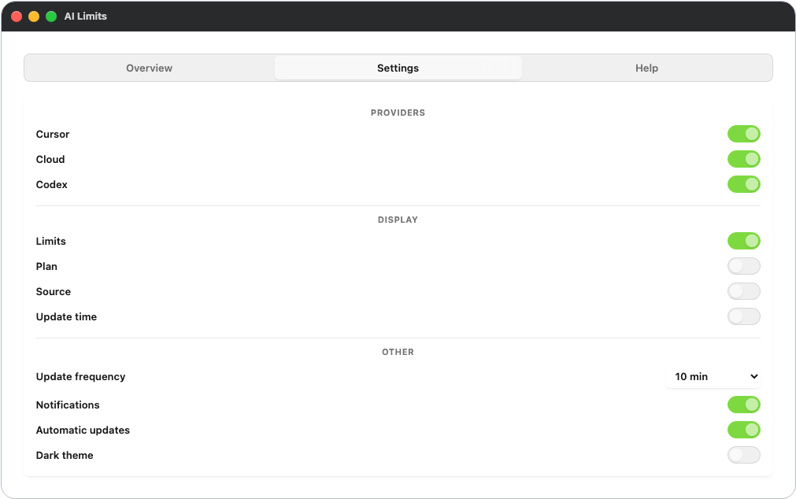
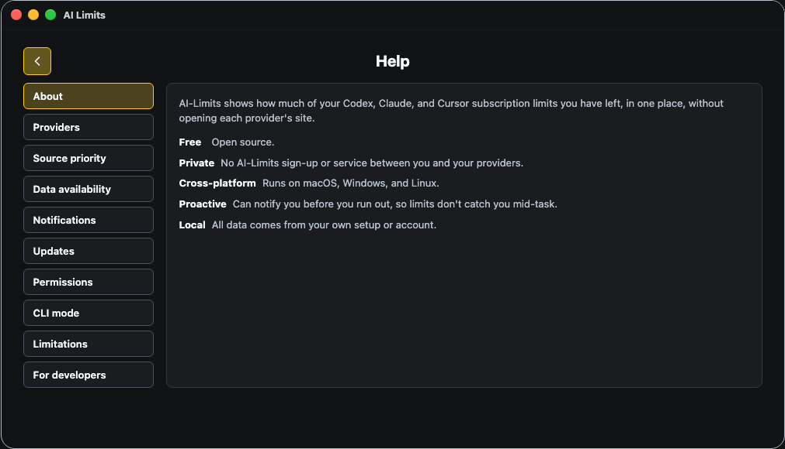

# ai-limits

| <a href="DE.md">DE</a> | <a href="../../README.md">EN</a> | <a href="ES.md">ES</a> | <a href="FR.md">FR</a> | PT | <a href="RU.md">RU</a> | <a href="ZH.md">中文</a> | <a href="AR.md">عربي</a> |

---

Aplicação local para controlar os limites e a utilização das subscrições de IA no Codex, Claude e Cursor.

  
  
  

---

  
  
  
  

## Vantagens

- Funciona sem subscrição de API,
- Sem inícios de sessão,
- Todos os fornecedores num só lugar,
- Completamente gratuita,
- Privada. Sem serviços de terceiros, proxies ou registos,
- Aplicação de ambiente de trabalho leve para Mac, Windows e Linux,
- Notificações de limites,
- Código aberto.

## Funcionalidades

- Mostra os limites, a data e hora de reinício, os tokens disponíveis e os reinícios manuais disponíveis,
- Funciona com Codex, Claude e Cursor,
- Obtém dados a partir de ficheiros locais, CLIs dos fornecedores e APIs,
- Lógica de fallback: se uma fonte estiver indisponível, verifica outra,
- Aplicação de ambiente de trabalho leve (macOS, Windows, Linux),
- Interface CLI com vários formatos de saída: `./bin/ai-limits`,
- Notificações do sistema ao atingir limiares de limite,
- Atualização de dados manual e automática flexível.

## Alternativas

| | **ai-limits** | [CodexBar](https://github.com/steipete/CodexBar) | [caut](https://github.com/Dicklesworthstone/coding_agent_usage_tracker) |
| --- | :---: | :---: | :---: |
| Aplicação de ambiente de trabalho e CLI | ✅ | ✅ | ❌ |
| Codex, Claude e Cursor | ✅ | ✅ | ✅ |
| macOS, Windows e Linux | ✅ | ❌ | ❌ |
| Sem serviço intermediário | ✅ | ✅ | ✅ |

A comparação completa com 18 alternativas e 16 critérios está no [catálogo de alternativas](../product/analogues.tsv).

## Suporte de plataformas e limitações

- macOS: a aplicação está assinada e notariada; as notificações funcionam,
- Windows e Linux: as builds estão disponíveis; o suporte evolui com base no feedback dos utilizadores,
- As notificações da aplicação de ambiente de trabalho estão por enquanto disponíveis apenas no macOS,
- Algumas fontes locais do Codex e do Claude podem ainda não funcionar no Windows e no Linux (as fontes via CLI funcionam em todo o lado).

## Licença

[Licença MIT](../../LICENSE)
