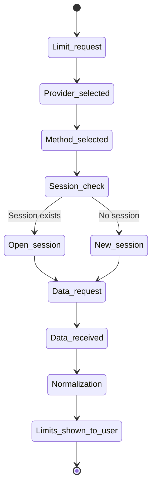

# Provider CLI Virtual Terminal Sessions

## Virtual Terminal and CLI Sessions

The diagram below describes the runtime session for interactive CLIs that require a pseudoterminal.

---

## Runtime Shutdown

A virtual terminal lives only for the duration of the active application runtime. When the runtime terminates, the application must synchronously shut down all open virtual terminals and associated provider sessions.

This rule is for resource control: the application must not create terminals uncontrollably and leave them running after the user exits or the process stops.
